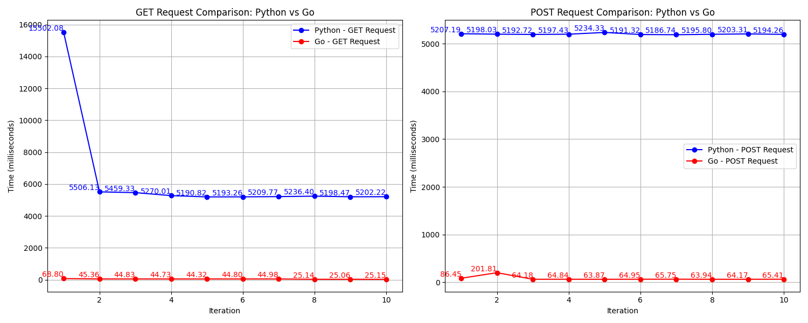

# Benchmarking  Server Performance Python's Django vs. Go

This project benchmarks the performance of Python's Django and DjangoRestFramework and Go servers for GET and POST requests using the Python `requests` library and measures the response times for each iteration.

## Setup

### Installation

1. Clone the repository:
   ```bash
   git clone https://github.com/kaustubha-chaturvedi/Go-VS-DjangoRestFramewor.git

2. Install the required Python packages:
    ```bash 
    pip install -r requirements.txt

3. Running the Benchmark

    Adjust the server URLs in the Python script to match your Python and Go server endpoints.

    Run the benchmark script:
    ```bash
    python bench.py

### Results
CSV File
The benchmark results are stored in a CSV file named `benchmark_results.csv`, containing the iteration number, times for GET and POST requests in milliseconds, and their respective status codes.

### Graphs
Single graph `Comparision.png` is generated

