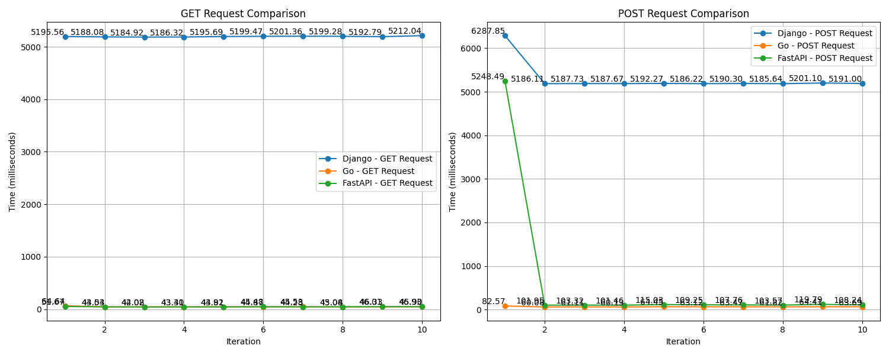

# Benchmarking  Server Performance Python's Django vs. Go

This project benchmarks the performance of Python's Django and DjangoRestFramework and Go servers for GET and POST requests using the Python `requests` library and measures the response times for each iteration.

- Both servers use same production database server running Postgres.
- Each GET and POST Request queries db synchronously. 
- First Get and then Post Query request is made to test read write operations.

## Setup

### Installation

1. Clone the repository:
   ```bash
   git clone https://github.com/kaustubha-chaturvedi/Go-VS-DjangoRestFramework.git

2. Install the required Python packages:
    ```bash 
    pip install -r requirements.txt

3. Running the Benchmark

    Adjust the server URLs in the Python script to match your Python and Go server endpoints.

    Run the benchmark script:
    ```bash
    python bench.py

### Results
CSV File
The benchmark results are stored in a CSV file named `benchmark_results.csv`, containing the iteration number, times for GET and POST requests in seconds.

|Iteration|Python - GET Time (seconds)|Go - GET Time (seconds)|Python - POST Time (seconds)|Go - POST Time (seconds)|
|---------|---------------------------|-----------------------|----------------------------|------------------------|
|1        |15.531612157821655         |0.06501126289367676    |5.2219462394714355          |0.08261561393737793     |
|2        |5.188480377197266          |0.02533411979675293    |5.187118053436279           |0.061350345611572266    |
|3        |5.214491128921509          |0.02472066879272461    |5.290483236312866           |0.06078648567199707     |
|4        |5.18528413772583           |0.02502608299255371    |5.1930835247039795          |0.06177115440368652     |
|5        |5.196741819381714          |0.026674509048461914   |5.191112995147705           |0.0625603199005127      |
|6        |5.194392442703247          |0.02492356300354004    |5.197656154632568           |0.06326770782470703     |
|7        |5.194849014282227          |0.02581048011779785    |5.2015345096588135          |0.06098818778991699     |
|8        |5.209357500076294          |0.025163650512695312   |5.1983397006988525          |0.0626058578491211      |
|9        |5.197456121444702          |0.024878501892089844   |5.190222978591919           |0.06268048286437988     |
|10       |5.204586744308472          |0.024721860885620117   |5.199313640594482           |0.0610809326171875      |

### Graphs
Single graph `Comparision.png` is generated

